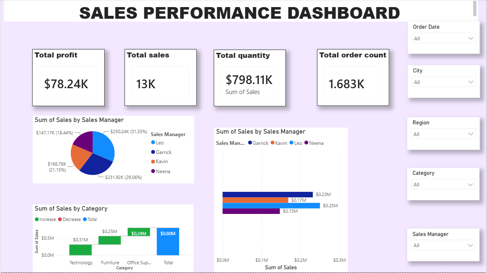
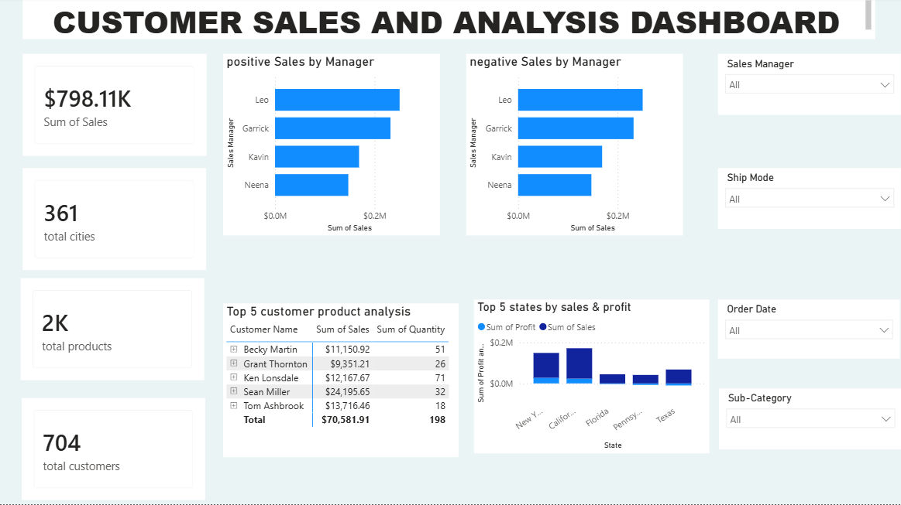
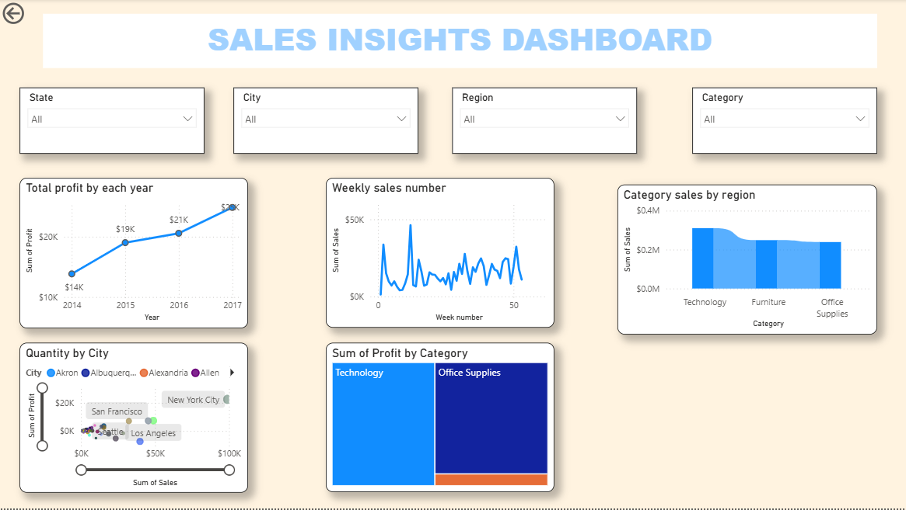

# Power-BI-Sales-Performance-Dashboard
Interactive Power BI Sales Performance Dashboard using DAX, Power Query, KPIs, and advanced data visualization.
## Project Overview
This project analyzes sales performance using interactive Power BI dashboards.

## Features
- KPI Cards
- Sales Performance Analysis
- Customer Sales Analysis
- Sales Insights Dashboard
- Advanced Visualizations
- Interactive Filters and Slicers

## Tools Used
- Power BI
- Power Query
- DAX
- Data Modeling

## Dashboard Screenshots

### Report 1 - Sales Performance Dashboard
 ## Project Overview
This project analyzes sales performance using interactive Power BI dashboards.

## Features
- KPI Cards
- Sales Performance Analysis
- Customer Sales Analysis
- Sales Insights Dashboard
- Advanced Visualizations
- Interactive Filters and Slicers

## Tools Used
- Power BI
- Power Query
- DAX
- Data Modeling

## Dashboard Screenshots

